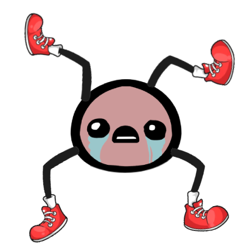

# All For One

*From The Group MeEeEe 🐑*

A co-op 2D climbing game controlled with your body. Up to four players share one
four-legged character: a webcam tracks everyone's arms, and each arm drives one of
the character's legs. Open your mouth to make your feet sticky and climb walls.
Get the character's head to the flag on the top-right peak as fast as you can.



## How it plays

- **Arms → legs.** Your shoulder angle sets a leg's hip angle and your elbow angle sets its knee.
- **Physics.** Gravity, plus contact on the feet and head. Push a planted foot into the ground
  to jump; sweep a planted leg to walk.
- **Mouth open = sticky feet.** Your shoes turn green. A sticky foot that touches rock
  glues to it (purple shoe) and can pull the body, so you can hang and climb.
- **Goal.** Touch the flag with the head. The timer stops and your best time is kept for the session.

| Players | Who controls what |
|---|---|
| 1 | Two long legs. Left arm → left leg, right arm → right leg. Tilt your head right/left to choose which foot your open mouth makes sticky. |
| 2 | P1's arms → top legs, P2's arms → bottom legs |
| 3 | P1's arms → top legs, P2's left arm → bottom-left, P3's right arm → bottom-right |
| 4 | One arm each: P1 top-left, P2 top-right, P3 bottom-left, P4 bottom-right |

Players are numbered left to right as they stand in front of the camera. In the camera
preview only the arms that control a leg are coloured (P1 red, P2 green, P3 blue, P4 yellow).

**1P TEST** in the menu shows the character on a white screen so you can check your arm
control, mouth and head tilt without the level.

## Install

Python 3.12:

```bash
pip install -r requirements.txt
```

The pose model (`yolo26n-pose.pt`) and the face model (`face_landmarker.task`) download
automatically the first time you run the game.

## Run

```bash
python main.py              # webcam 0
python main.py --source 1   # another webcam
python main.py --keyboard   # no camera, keyboard debug controls (see inputs.py)
```

| Key | Action |
|---|---|
| F11 | fullscreen on/off |
| F5 | restart the level |
| F1 | show collision circles |
| Esc | back to menu / quit |

## Faster detection (NVIDIA GPU)

With the CUDA build of PyTorch, the game uses the GPU automatically. For even more speed,
build a TensorRT engine once per computer (it only works on the GPU it was built on):

```bash
pip install tensorrt-cu13
python export_engine.py
```

The game picks the fastest backend it finds: TensorRT, then the GPU, then the CPU. The camera
preview shows which one is in use next to the FPS.

## Code

| File | What it does |
|---|---|
| `main.py` | entry point and command-line options |
| `app.py` | owns the window, switches between menu, game and test |
| `display.py` | single-window layout: game left, camera right, fullscreen |
| `menu.py`, `ui.py` | title screen, player picker, buttons |
| `game.py` | the level: physics loop, HUD, timer, flag/finish |
| `test_scene.py` | 1-player test screen |
| `character.py` | legs, kinematics, contact physics, sticky feet |
| `terrain.py` | map image and collision (signed distance field from `foreground.png`) |
| `flag.py` | goal flag |
| `viewport.py` | camera that follows the character |
| `assets.py` | character sprite loading, leg stretching, shoe colour filters |
| `vision.py` | webcam thread: YOLO pose + MediaPipe face, players, mouths, head tilt |
| `player_state.py` | arm/leg angle math shared by camera and keyboard input |
| `preview.py` | draws the camera preview |
| `inputs.py` | input interface + keyboard controls |
| `config.py` | every tunable number |
| `export_engine.py` | builds the TensorRT engine |
| `pose_and_face_test.py` | original pose + face detection experiment |
